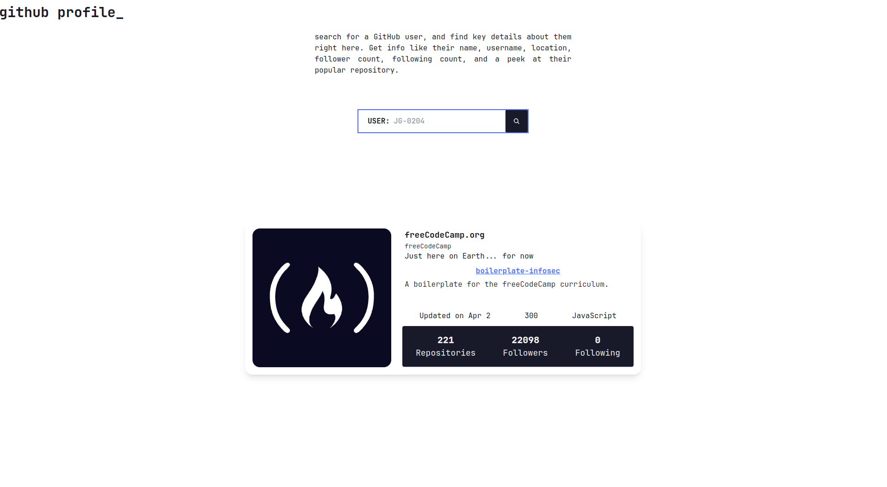

# Github User Info

## Description

A simple page that uses [Github REST API](https://docs.github.com/en/rest/guides/getting-started-with-the-rest-api?apiVersion=2022-11-28&tool=javascript) to search github users and show their information.

## Features

- Enter a GitHub username to get user information.
- Displays some user's profile details.
- Shows the most-starred repository of the user.

mediocre error handling, bad folder structure and also mediocre use of tailwindcss.
